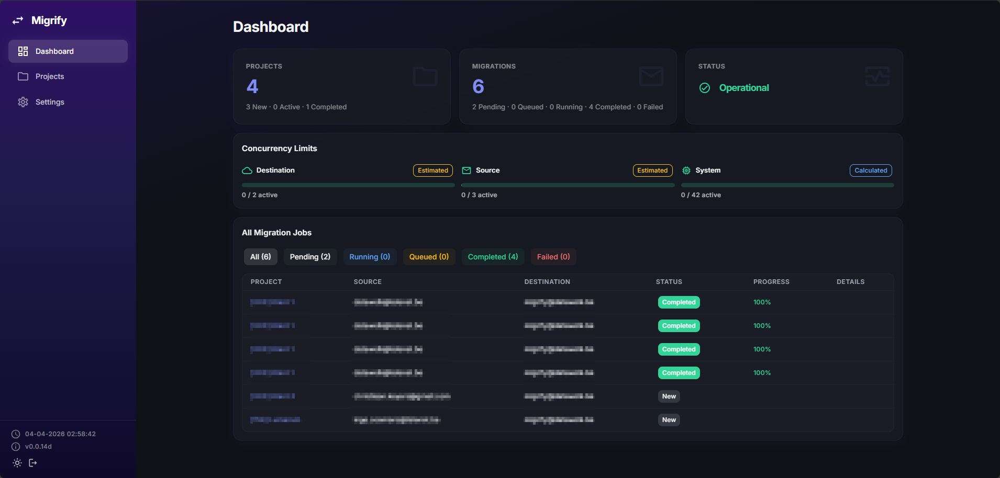
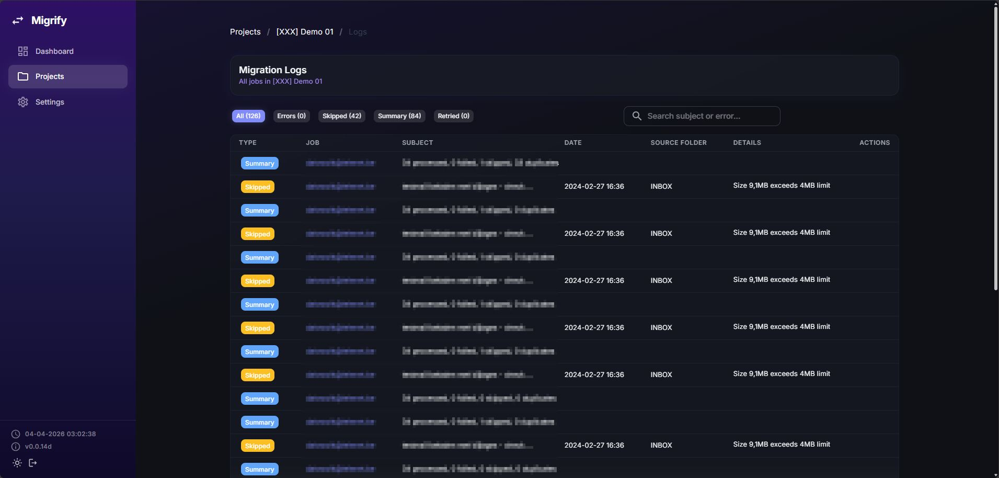
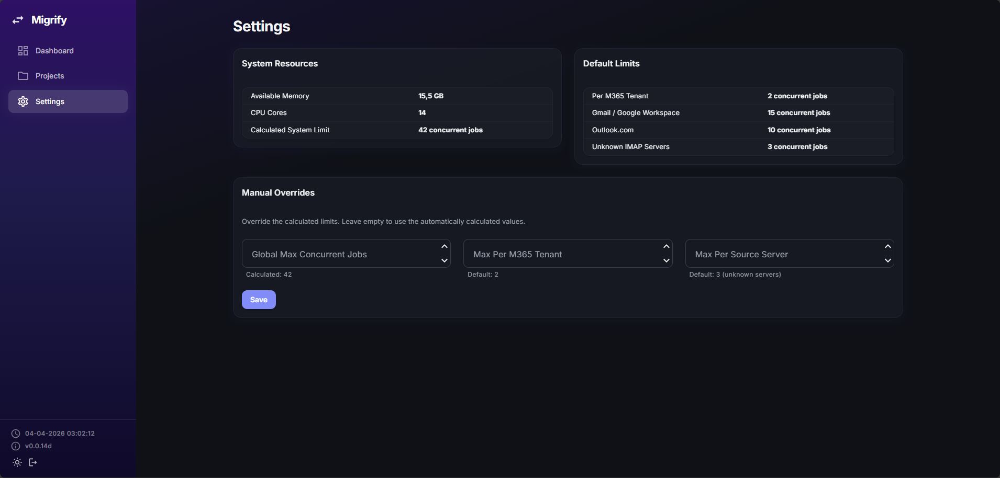

# Migrify

**A universal mailbox migration tool that moves any mailbox type to Microsoft 365, fast and hopefully reliable.**

> Built by a non-developer with zero coding skills, mass amounts of coffee, and a mass amount of AI prompts.
> This is vibe coding at its finest. If it works, don't ask why. If it doesn't, yeah... that tracks.

## What does it do?

Migrify migrates email from IMAP mailboxes (Gmail, Outlook, Yahoo, your uncle's self-hosted mail server from 2003) to Microsoft 365 Exchange Online. And yes — it actually works now. Emails go in on one side and come out on the other. Most of the time.

### Features

**Source connectors**
- Manual IMAP with password or OAuth2 authentication
- Google Workspace with service account & domain-wide delegation
- Bulk mailbox discovery via Google Admin SDK and Graph API

**Destination connector**
- Microsoft 365 via Graph SDK (app-only auth)
- Per-job folder mapping with auto-map, manual mapping, and inline folder creation

**Migration engine**
- Full copy and incremental migration modes
- Date range filtering, duplicate detection (Message-ID), and rate limiting (Graph API compliant)
- Parallel execution: multiple jobs run simultaneously with a global FIFO queue
- Smart concurrency limits: 3-layer model (system resources, per M365 tenant, per source server)
- Resume interrupted migrations from checkpoint (re-evaluates skipped/failed messages)
- Automatic retry with exponential backoff for transient errors (429/503/504/408)
- Per-mail retry and bulk retry for failed messages

**Monitoring & UI**
- Real-time progress tracking via SignalR (live progress bars, status chips, folder updates)
- Dashboard with cross-project job overview, queue positions, and wait reasons
- Concurrency limit panels with per-layer occupancy and confidence indicators
- Searchable migration logs at project and job level with type filtering
- Premium dark/light UI with MudBlazor

## Screenshots

*Dashboard — project overview, concurrency limits, and cross-project job status*

*Project detail — connector configuration, concurrency limits, and migration jobs with bulk start*

*Migration logs — filterable by type, searchable, with per-mail details*

*Settings — system resources, provider limits, and manual concurrency overrides*

## Tech Stack

| Layer | Tech |
|-------|------|
| Frontend | Blazor Server + MudBlazor |
| Backend | C# / ASP.NET Core 10 |
| Database | PostgreSQL + Entity Framework Core |
| IMAP | MailKit |
| M365 | Microsoft Graph SDK |
| Real-time | SignalR |
| Deployment | Docker + Nginx |

## Status

**Work in progress.** But the kind of progress where emails actually migrate now. The foundation is there, the walls are up, and the roof is... getting there. Still wouldn't host a dinner party though.

Current version: `v0.0.14d`

The version numbering starts at 0.0.1 because even 1.0 feels too optimistic right now.

## Can I use this?

Technically? Yes. Small migrations are actually working. Should you trust your 50,000-email production mailbox to software built by someone who learned what a `DbContext` is last week? That's between you and your backup strategy.

## Roadmap

There is one. It's ambitious. It currently involves data retention policies and eventually Docker deployment. The email migration part? That's actually done. Failed mails can be retried, interrupted migrations can be resumed, and incremental sync re-runs only fetch new emails. Wild.

## License

Not yet decided. For now: look, laugh, learn.

---

*Built with vibes, not skills. Powered by caffeine, AI, and the unshakable belief that "it works on my machine" counts as QA.*
